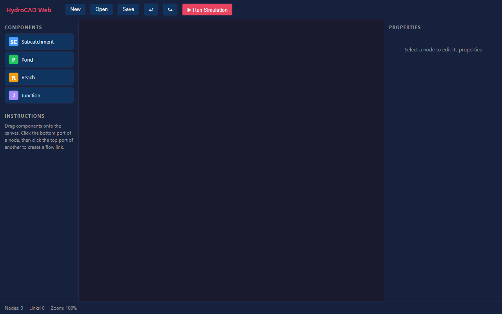
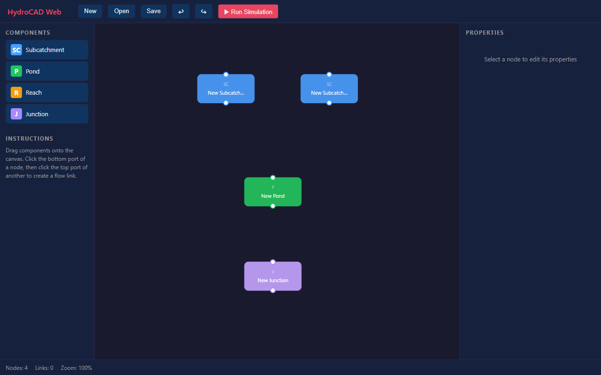
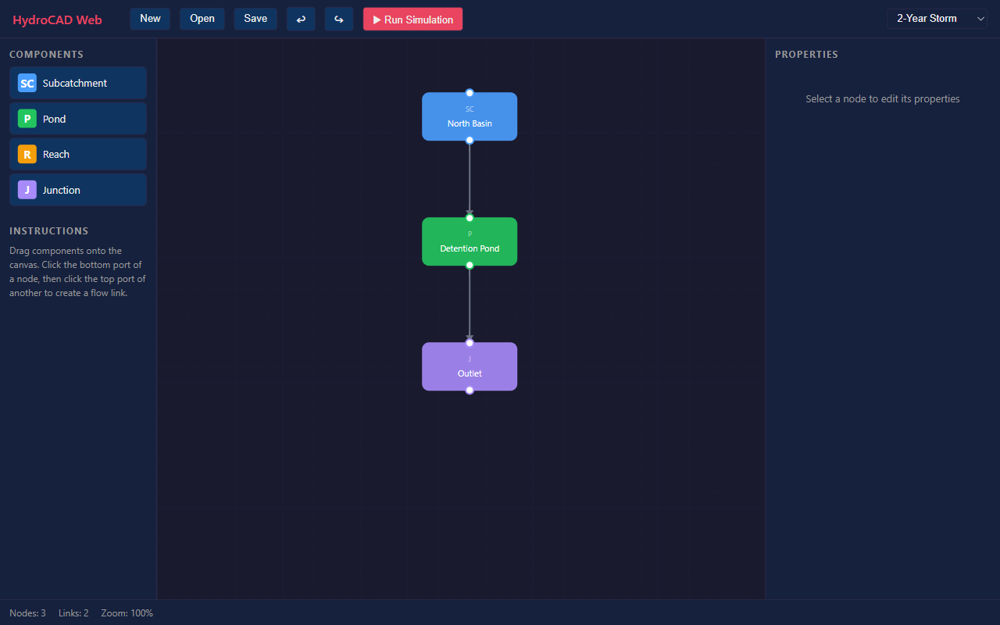
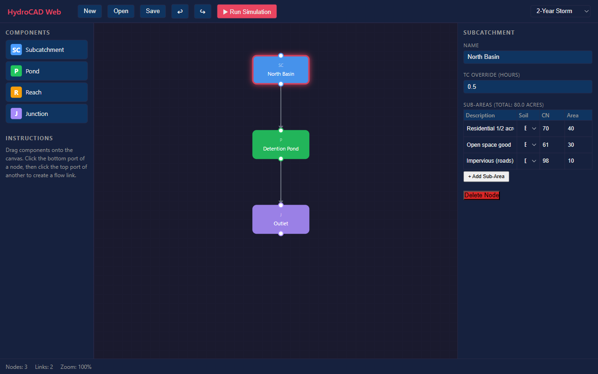
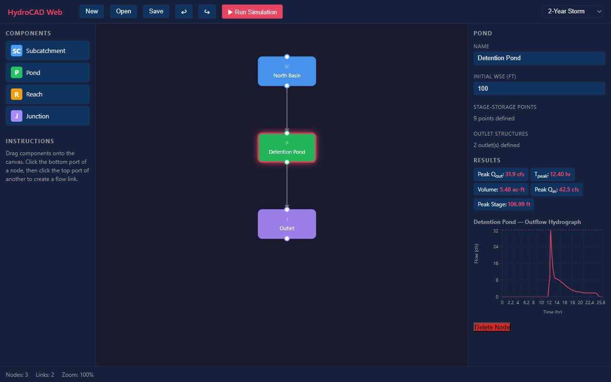
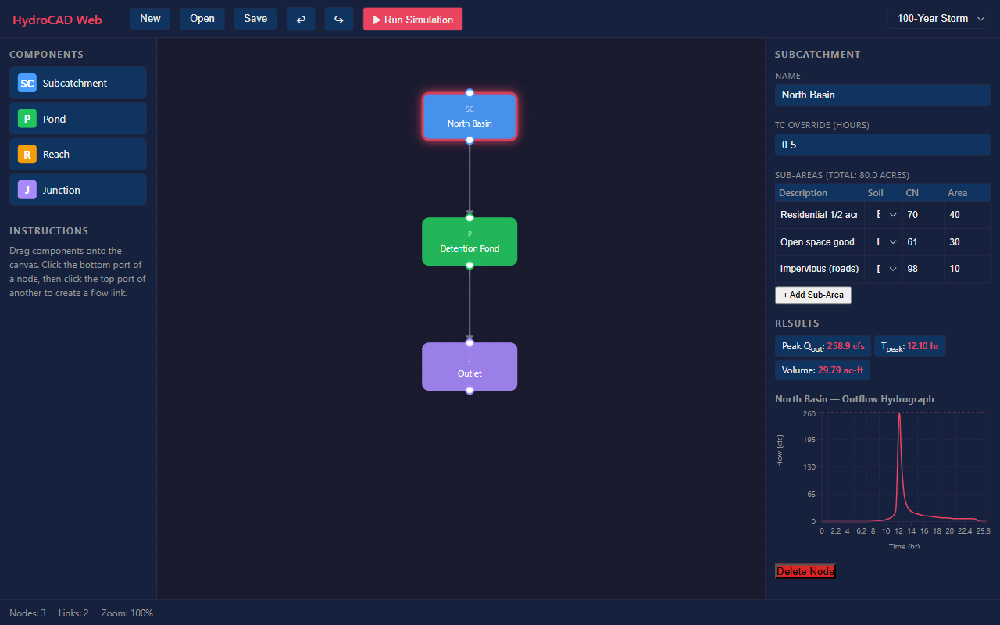

# StormLab — Demo Walkthrough

A visual tour of StormLab, a browser-based stormwater modeling tool that implements the USDA/NRCS TR-55 hydrology methods with an interactive routing diagram editor.

---

## 1. Empty Workspace

When you first open StormLab, you see the three-panel layout:
- **Left:** Component stencil palette (Subcatchment, Pond, Reach, Junction)
- **Center:** SVG routing diagram canvas with grid background
- **Right:** Property editor panel
- **Top:** Toolbar with New, Open, Save, Undo/Redo, and Run Simulation
- **Bottom:** Status bar showing node count, link count, and zoom level



---

## 2. Drag-and-Drop Node Placement

Drag components from the stencil palette onto the canvas to build your drainage system. Each node type has a distinct color:
- 🔵 **Subcatchment** (blue) — generates runoff using SCS Curve Number method
- 🟢 **Pond** (green) — routes flow through storage with outlet structures
- 🟠 **Reach** (orange) — routes flow through a channel using Manning's equation
- 🟣 **Junction** (purple) — sums inflows from multiple upstream nodes

Each node has **input ports** (top) and **output ports** (bottom) for creating flow connections.



---

## 3. Loading a Project

Click **Open** to load a project JSON file. The example project models a typical land development scenario:

- **North Basin** — 80-acre subcatchment with mixed land use (residential, open space, impervious roads)
- **Detention Pond** — storage pond with a low-flow orifice and emergency spillway weir
- **Outlet** — downstream discharge point

Flow links (directional arrows) automatically show the drainage path. The **storm event selector** (top-right) shows all configured rainfall events.



---

## 4. Property Editing

Click any node to edit its properties in the right panel. For a **subcatchment**, you can configure:

- **Name** — displayed on the node label (updates live on the canvas)
- **Tc Override** — time of concentration in hours
- **Sub-Areas Table** — each row defines a land use with:
  - Description (e.g., "Residential 1/2 acre")
  - Hydrologic Soil Group (A/B/C/D dropdown)
  - SCS Curve Number
  - Area in acres

The total drainage area is automatically computed and displayed. Click **+ Add Sub-Area** to add more land use types.



---

## 5. Simulation Results — 2-Year Storm

Click **▶ Run Simulation** to execute the full hydrological analysis. Results appear instantly in the property panel when you select a node.

For the **Detention Pond** under the **2-Year Storm** (3.2 inches of rainfall):

| Metric | Value |
|--------|-------|
| Peak Inflow (Q_in) | 42.5 cfs |
| Peak Outflow (Q_out) | 31.9 cfs |
| **Peak Reduction** | **25%** |
| Time to Peak | 12.40 hr |
| Total Volume | 5.48 ac-ft |
| Peak Stage | 106.99 ft |

The **outflow hydrograph** chart shows the attenuated discharge curve — the pond stores water during the peak and releases it gradually through the orifice outlet.



---

## 6. Multi-Event Comparison — 100-Year Storm

Switch to the **100-Year Storm** (8.0 inches) using the dropdown selector. Results update instantly:

| Metric | 2-Year | 100-Year |
|--------|--------|----------|
| Peak Inflow | 42.5 cfs | 258.9 cfs |
| Peak Outflow | 31.9 cfs | 74.8 cfs |
| **Peak Reduction** | **25%** | **71%** |
| Peak Stage | 106.99 ft | 108.00 ft |
| Volume | 5.48 ac-ft | 21.67 ac-ft |

The 100-year storm overwhelms the orifice and activates the **emergency spillway weir** (crest at 106 ft), but the pond still provides 71% peak reduction. The peak stage of 108 ft confirms the pond has adequate freeboard.


---

## 7. Subcatchment Hydrograph

Clicking the **North Basin** subcatchment shows its runoff hydrograph — the classic SCS Type II shape with a sharp peak at hour 12 (the center of the 24-hour storm). 

For the 100-year event:
- **Peak outflow:** 258.9 cfs
- **Total volume:** 29.79 ac-ft
- **Time to peak:** 12.10 hr

The sub-areas table shows the mixed land use that generates this runoff: 40 acres of residential (CN=70), 30 acres of open space (CN=61), and 10 acres of impervious roads (CN=98).



---

## Key Capabilities

### Hydrology Engine
- ✅ SCS Curve Number method (TR-55)
- ✅ Rainfall distributions (Type I, IA, II, III)
- ✅ Time of concentration (sheet, shallow, channel flow)
- ✅ SCS unit hydrograph (peak factor 484)
- ✅ Composite CN for mixed land use

### Hydraulics Engine
- ✅ Modified Puls pond routing (storage-indication method)
- ✅ Outlet structures: weirs, orifices
- ✅ Stage-storage for prismatic, conical, cylindrical shapes
- ✅ Reach routing with Manning's equation

### User Interface
- ✅ Visual routing diagram with SVG (pan, zoom, drag)
- ✅ Drag-and-drop stencil palette
- ✅ Port-based flow link creation
- ✅ Inline property editing with sub-areas table
- ✅ Hydrograph charts (Recharts)
- ✅ Multi-event storm comparison
- ✅ Save/Load JSON project files
- ✅ Undo/Redo (Ctrl+Z / Ctrl+Y)
- ✅ Project validation

### Testing
- ✅ 79 engine unit tests (validated against TR-55 worked examples)
- ✅ 12 Playwright E2E tests
- ✅ CLI runner for headless simulation

---

## Getting Started

```bash
pnpm install
pnpm dev        # → http://localhost:1420
```

Or run a simulation from the command line:
```bash
cd packages/engine
npx tsx cli/run.ts ../../docs/example-project.json --event 100yr
```

```
Running simulation: Example Detention Pond — Event: 100yr
---
Node                Type              Peak Qin   Peak Qout   Tp (hr) Vol (ac-ft)
--------------------------------------------------------------------------------
North Basin         subcatchment             -       258.9     12.10       29.79
Detention Pond      pond                 258.9        74.8     11.80       21.67
Outlet              junction                 -        74.8     11.80       21.67
```
